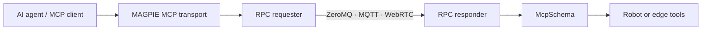

import Tabs from '@theme/Tabs';
import TabItem from '@theme/TabItem';

# MCP and AI agents

MAGPIE makes an operational service directly consumable by AI tools. `McpSchema` exposes registered methods through the Model Context Protocol (MCP), while a client adapter carries MCP messages through any MAGPIE RPC requester.

The result is one service contract for ordinary applications and agents:



## Why this matters for edge systems

A robot behind NAT can make an outbound MQTT connection. An agent in the cloud connects to the same broker, discovers the robot’s tools, and calls them without opening an inbound port or running a separate MCP gateway on the robot.

MCP does not replace authentication or authorization. It standardizes discovery and calls; transport security and tool policy remain application responsibilities.

## Define tools on the service

<Tabs groupId="language" queryString>
<TabItem value="python" label="Python" default>

```python
from luxai.magpie.schema import McpSchema

schema = McpSchema(name="robot-service", version="1.0.0")

@schema.method()
def get_battery() -> dict:
    """Return the robot battery level and charging state."""
    return {"level": 0.82, "charging": False}

@schema.method()
def look_at(yaw: float, pitch: float) -> dict:
    """Move the robot head to the requested angles."""
    return {"accepted": True, "yaw": yaw, "pitch": pitch}
```

</TabItem>
<TabItem value="cpp" label="C++">

```cpp
#include <magpie/schema/mcp_schema.hpp>

auto schema = std::make_shared<magpie::McpSchema>("robot-service", "1.0.0");

schema->register_method(
    "get_battery",
    [](const magpie::Value::Dict&) {
        magpie::Value::Dict result;
        result["level"] = magpie::Value::fromDouble(0.82);
        result["charging"] = magpie::Value::fromBool(false);
        return magpie::Value::fromDict(result);
    },
    "Return the robot battery level and charging state");
```

MAGPIE C++ provides the MCP tool server. A Python or TypeScript MCP client can call it over any compatible MAGPIE transport.

</TabItem>
<TabItem value="typescript" label="TypeScript">

```typescript
import {McpSchema} from '@luxai-qtrobot/magpie'

const schema = new McpSchema({name: 'robot-service', version: '1.0.0'})

schema.register(
  'get_battery',
  () => ({level: 0.82, charging: false}),
  {
    description: 'Return the robot battery level and charging state',
    inputSchema: {type: 'object', properties: {}},
    outputSchema: {type: 'object'},
  },
)
```

</TabItem>
</Tabs>

Good descriptions and schemas matter: they are the information an agent uses to decide whether and how to call a tool.

## Attach the schema to a responder

The schema is transport-independent. Attach the same `schema` to the responder appropriate for the deployment:

```python
# Direct connection
server = ZMQRpcResponder("tcp://*:5556", schema=schema)

# Brokered connection; convenient behind NAT
connection = MqttConnection("mqtts://broker.example.com:8883")
connection.connect()
server = MqttRpcResponder(connection, service_name="robot-01", schema=schema)

# Peer-to-peer connection
peer = WebRTCConnection.with_mqtt(
    "mqtts://broker.example.com:8883", session_id="robot-01"
)
peer.connect()
server = WebRTCRpcResponder(peer, service_name="robot-01", schema=schema)
```

## Connect an agent client

<Tabs groupId="language" queryString>
<TabItem value="python" label="Python / FastMCP" default>

Install the client integration:

```bash
pip install "luxai-magpie[mqtt,mcp]"
```

```python
import asyncio
from fastmcp import Client
from luxai.magpie.adapters.mcp import McpTransport
from luxai.magpie.transport import MqttConnection, MqttRpcRequester

async def main():
    connection = MqttConnection("mqtts://broker.example.com:8883")
    connection.connect()
    requester = MqttRpcRequester(connection, service_name="robot-01")

    try:
        async with Client(McpTransport(requester)) as client:
            tools = await client.list_tools()
            print([tool.name for tool in tools])

            result = await client.call_tool("get_battery", {})
            print(result.content[0].text)
    finally:
        requester.close()
        connection.disconnect()

asyncio.run(main())
```

</TabItem>
<TabItem value="typescript" label="TypeScript MCP SDK">

```bash
npm install @luxai-qtrobot/magpie @modelcontextprotocol/sdk
```

```typescript
import {Client} from '@modelcontextprotocol/sdk/client/index.js'
import {McpTransport, MqttConnection, MqttRpcRequester} from '@luxai-qtrobot/magpie'

const connection = new MqttConnection('mqtts://broker.example.com:8883')
await connection.connect()
const requester = new MqttRpcRequester(connection, 'robot-01')

const client = new Client({name: 'operator-agent', version: '1.0.0'})
await client.connect(new McpTransport(requester))

const {tools} = await client.listTools()
console.log(tools.map((tool) => tool.name))

const result = await client.callTool({name: 'get_battery', arguments: {}})
console.log(result.content)

await client.close()
requester.close()
await connection.disconnect()
```

</TabItem>
</Tabs>

The MCP transport borrows the requester. Close the MCP client first, then the requester, then the shared connection.

## Tool design for physical systems

- Expose narrow operations with explicit units, ranges, and consequences.
- Validate every argument server-side even when an MCP client validates first.
- Separate read-only observation tools from actions that change physical state.
- Require confirmation or policy checks for dangerous or irreversible actions.
- Apply authorization per tool and per robot—not only per broker connection.
- Return structured, actionable errors rather than ambiguous text.
- Log tool identity, caller identity, request ID, outcome, and duration.

:::warning[An agent is not a safety controller]

Keep collision avoidance, limits, emergency stops, and other safety mechanisms below the agent/tool layer. A successful MCP call must still pass the robot’s normal safety checks.

:::

