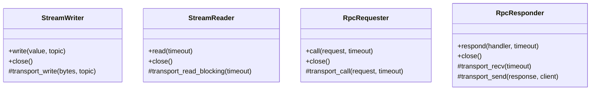

# Architecture

MAGPIE is layered so application code depends on stable abstractions while transport implementations remain thin and replaceable.

## Layers

### 1. User application

Application code uses four actions:

| Intent | API |
|---|---|
| Publish a stream item | `writer.write(frame, topic)` |
| Receive a stream item | `reader.read(...)` |
| Call a remote service | `requester.call(request, ...)` |
| Process one request | `responder.respond(handler, ...)` |

The application does not need to manage transport threads, packet envelopes, or response correlation.

### 2. Transport abstraction

The abstract writer, reader, requester, and responder classes own shared behavior such as queues, lifecycle, serialization, timeouts, and error propagation. A transport implements only its I/O boundary.

### 3. Transport implementations

- **ZeroMQ** provides direct local or network communication with no broker.
- **MQTT** provides brokered routing, authentication, TLS, retained state, and NAT-friendly outbound connections.
- **WebRTC** provides peer-to-peer data and native audio/video tracks after a signaling handshake.

All three present the same stream and RPC concepts even though their wire behavior differs.

### 4. Frames and serialization

MAGPIE serializes values with MessagePack by default. Typed frames add a stable envelope containing identifiers, timestamps, type information, and media metadata. Deserializers reconstruct the corresponding frame type on the receiving side.

### 5. Schema and MCP adapters

`JsonRpcSchema` adds method dispatch and JSON Schema contracts without changing the transport. `McpSchema` builds the MCP lifecycle and tool operations on top. Client adapters let an MCP client use any MAGPIE RPC requester.

### 6. Nodes and tools

Node helpers add lifecycle management around the primitives. CLI tools use the same public APIs as applications, which makes them useful probes for testing endpoints and topics.

## Ownership rules

Clear ownership prevents duplicated connections and unexpected shutdowns:

- A component that creates a connection owns and closes it.
- Writers, readers, requesters, and responders borrow a shared MQTT or WebRTC connection unless documented otherwise.
- An MCP transport borrows the requester supplied to it; the caller closes the requester.
- Closing one component should not implicitly close a shared connection used by other components.

## Adding a transport

A new transport implements the protected I/O methods while inheriting queueing, lifecycle, and the public API. See [Extending MAGPIE](../extending) for a minimal implementation pattern.

