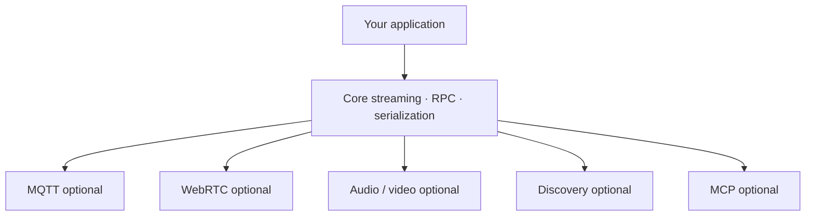

# Optional by design

MAGPIE separates capabilities so a simple service does not inherit the dependency tree of every transport and media format. This is especially important on robots and edge devices, where image size, startup time, build complexity, and system libraries matter.

## Capability layers

## Recommended installation strategy

1. Start with the core package or core C++ library.
2. Add the transport used by the deployment.
3. Add video or audio only to processes that encode, decode, capture, or play media.
4. Add MCP only to agent clients or services that expose tools.
5. Keep optional features explicit in lock files, containers, and build flags.

## Language-specific mechanisms

- **Python:** extras such as `[mqtt]`, `[webrtc]`, `[video]`, `[audio]`, `[discovery]`, and `[mcp]`.
- **C++:** separate Debian packages and CMake flags such as `MAGPIE_WITH_MQTT` and `MAGPIE_WITH_WEBRTC`.
- **TypeScript:** the core npm package includes MQTT and browser WebRTC; the official MCP SDK is needed only by MCP clients.

See [Installation](../start/installation) for exact commands.

:::tip Design process boundaries around dependencies
A camera process can install video support while a command service uses only the core. Both still communicate through the same MAGPIE contracts.
:::

