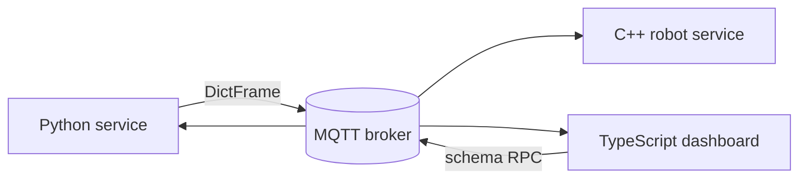

# Interoperability

MAGPIE implementations are designed to communicate directly across language boundaries. Interoperability comes from shared wire contracts rather than a bridge process.

## Shared contracts

| Layer | Contract |
|---|---|
| Serialization | MessagePack by default, or values supported by a custom serializer shared by every endpoint |
| Topics | UTF-8 topic names with transport-specific matching rules |
| Frames | Shared type names, metadata fields, and snake_case wire keys |
| MQTT RPC | Correlation ID, reply topic, acknowledgement, and payload envelope |
| WebRTC RPC | Shared request type, request ID, and payload envelope |
| Schema RPC | JSON-RPC 2.0 requests, results, and errors |
| MCP | MCP initialization, tool listing, and tool call messages over schema RPC |
| WebRTC signaling | Shared hello, offer, answer, and ICE exchange |

## Rules for portable payloads

- Prefer strings, booleans, numbers, byte arrays, lists, and string-keyed maps.
- Use MAGPIE frame types for images, audio, and values that need common metadata.
- Keep topic and service names identical, including case and separators.
- Keep JSON Schema property names stable across languages.
- Treat integer range and floating-point precision explicitly when C++ and JavaScript share numeric values.
- Do not rely on language-specific object serialization.

## Cross-language example

A Python writer and C++ reader can communicate over ZeroMQ. All three languages can communicate over MQTT. Python/C++ peers and browser peers can use compatible WebRTC signaling and wire formats where their supported media and transport features overlap.

See [Cross-language systems](../examples/cross-language) for a practical MQTT example and [Compatibility](../reference/compatibility) for the feature matrix.

## Version compatibility

Language packages are released independently. Before deploying a mixed-language system, verify that every implementation supports the transports, frame types, and schema features you plan to use. Pin package versions in production and exercise the complete path in integration tests.

