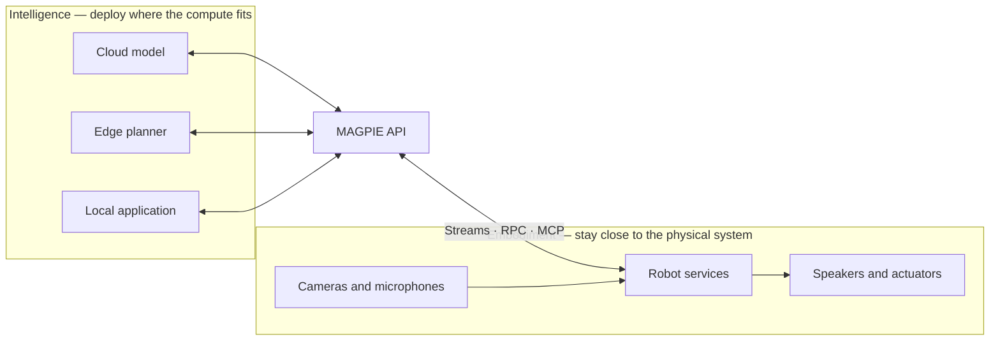

# A framework for developers and AI agents

Most distributed applications begin with a simple task—publish a camera frame, request an action, expose a tool—and gradually accumulate transport-specific code. Reconnection, queueing, correlation IDs, broker conventions, thread ownership, and media handling begin to shape the application itself.

MAGPIE draws a boundary between **what the application means** and **how bytes travel**.

## Separate intelligence from embodiment

Intelligence and embodiment have different deployment needs. A model may run in a cloud GPU service, planning on an edge computer, and low-level control on a robot. Cameras, microphones, speakers, and actuators remain close to the physical system.

MAGPIE lets those locations change without rewriting the behavior:

## Design principles

### Application code should not speak transport

The application calls `write`, `read`, `call`, or `respond`. A transport implementation owns sockets, broker topics, signaling, correlation, background I/O, and shutdown.

### Interoperability is a default, not a bridge

Python, C++, and TypeScript share message envelopes, frame fields, default MessagePack serialization, JSON-RPC semantics, and MCP behavior. A mixed-language deployment should not need a translation service. Applications may supply another serializer when every endpoint on that path uses the same format.

### The core should stay understandable

Four primitives cover most communication:

- `StreamWriter` publishes values or frames to topics.
- `StreamReader` receives topic-filtered streams.
- `RpcRequester` makes a request and waits for its correlated response.
- `RpcResponder` receives requests and dispatches handlers.

Higher-level schemas, nodes, tools, and MCP integration build on those primitives rather than bypassing them.

### Dependencies should follow features

Applications should not install a media stack to send dictionaries. MQTT, WebRTC, video, audio, discovery, and MCP are optional capabilities. This keeps small services small and deployment intent explicit.

### Operational tools are part of the framework

A protocol is easier to adopt when developers can inspect it. MAGPIE includes CLI readers, writers, request clients, video/audio utilities, discovery, and SSH tunneling so systems can be tested before custom UI or orchestration exists.

## What MAGPIE is—and is not

MAGPIE is a reusable communication layer for robotics, edge systems, distributed services, browser clients, and AI agents. It is not a centralized runtime, workflow engine, device registry, or cloud platform. You retain control of process layout, infrastructure, authentication, and deployment.

That narrow boundary is deliberate: MAGPIE connects components without owning the system around them.

