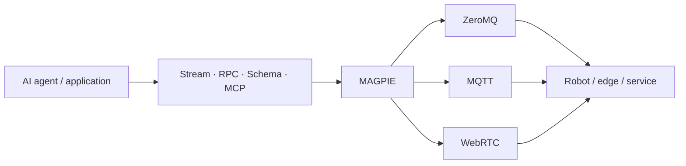

import Link from '@docusaurus/Link';

# Build distributed systems without coupling behavior to the wire

MAGPIE is a **transport-agnostic messaging and RPC framework for developers and AI agents**. It gives applications the same small communication API whether data travels over ZeroMQ, MQTT, WebRTC, or a transport you add yourself.

The central idea is simple:

> **Separate where intelligence runs from where sensing and action happen.**

An AI agent can run in the cloud, a perception pipeline on an edge computer, and a motor service on a robot. MAGPIE connects them without forcing application code to become networking code.

## What MAGPIE provides

  <Link className="doc-card" to="/docs/guides/streaming">
    DATA FLOW
    <strong>Topic-based streaming</strong>
    
Publish telemetry, events, images, audio, and typed frames without coupling producers to consumers.

  </Link>
  <Link className="doc-card" to="/docs/guides/rpc">
    COMMANDS
    <strong>Request and response RPC</strong>
    
Call remote services with acknowledgements, timeouts, correlation, and transport-independent handlers.

  </Link>
  <Link className="doc-card" to="/docs/guides/schema-rpc">
    CONTRACTS
    <strong>Schema-based APIs</strong>
    
Describe methods with JSON Schema and use the same contract for validation, dispatch, and discovery.

  </Link>
  <Link className="doc-card" to="/docs/ai/mcp">
    AI NATIVE
    <strong>MCP integration</strong>
    
Expose MAGPIE services directly as tools that AI clients can discover and call.

  </Link>

## Why teams choose it

- **One mental model.** `StreamWriter`, `StreamReader`, `RpcRequester`, and `RpcResponder` remain recognizable across transports and languages.
- **Real interoperability.** Python, C++, and TypeScript implementations share the same wire formats and can communicate directly.
- **Deployment freedom.** Use direct local connections, brokered communication across NAT, or peer-to-peer WebRTC without redesigning the application.
- **Optional complexity.** The core stays small. MQTT, WebRTC, media, discovery, and MCP are enabled only when needed.
- **Useful operational tools.** Command-line readers, writers, request clients, media utilities, network discovery, and SSH-over-MQTT are part of the ecosystem.

## Choose your path

If this is your first time here, follow these three pages:

1. [Choose a language](./start/choose-language) for the runtime and capabilities you need.
2. [Install MAGPIE](./start/installation) with only the optional features your project uses.
3. [Run the quickstart](./start/quickstart) and send your first message.

If you already know messaging systems, start with [the four core APIs](./concepts/core-api) or compare the [available transports](./transports/overview).

:::tip The documentation is concept-first
Most guides use synchronized Python, C++, and TypeScript tabs. Choose a language once and Docusaurus remembers it while you move through the site.
:::

