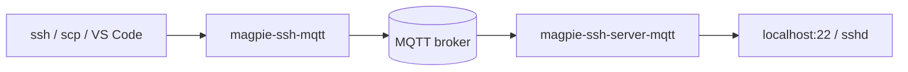

# SSH over MQTT

`magpie-ssh-server-mqtt` and `magpie-ssh-mqtt` tunnel a standard SSH byte stream through MQTT. The remote machine connects outbound to the broker, so it can remain behind NAT or a firewall with no public IP.

SSH encryption remains end-to-end inside the MQTT messages. The broker routes ciphertext; it does not replace SSH authentication.



## Quickstart

Install the MQTT tools on both machines:

```bash
pip install "luxai-magpie[mqtt]"
```

On the robot or remote machine:

```bash
magpie-ssh-server-mqtt mqtts://broker.example.com:8883 robot-01 \
  --mqtt-params @/etc/magpie/mqtt.json
```

On the client:

```bash
magpie-ssh-mqtt mqtts://broker.example.com:8883 robot-01 \
  --mqtt-params @~/.config/magpie/mqtt.json
```

Arguments after the node ID are forwarded to the system SSH client:

```bash
magpie-ssh-mqtt mqtt://broker.example.com:1883 robot-01 -l developer
magpie-ssh-mqtt mqtt://broker.example.com:1883 robot-01 uptime
magpie-ssh-mqtt mqtt://broker.example.com:1883 robot-01 -i ~/.ssh/id_ed25519
```

MAGPIE options such as `--mqtt-params`, `--timeout`, and `-v` must appear before the node ID. SSH options appear after it.

## ProxyCommand

ProxyCommand mode makes ordinary SSH-compatible tools use the MQTT tunnel. Add an entry to `~/.ssh/config`:

```sshconfig
Host robot-01
    ProxyCommand magpie-ssh-mqtt --proxy mqtts://broker.example.com:8883 --mqtt-params @~/.config/magpie/mqtt.json %h
    User developer
    IdentityFile ~/.ssh/id_ed25519
```

You can then use standard tools unchanged:

```bash
ssh robot-01
scp robot-01:/var/log/robot.log .
rsync -av robot-01:/data/ ./backup/
sftp robot-01
```

VS Code Remote SSH also uses the same configuration.

## Server options

The server forwards accepted sessions to `127.0.0.1:22` by default. Use `--sshd-host` and `--sshd-port` when SSH runs elsewhere on the local network or on a non-default port.

## Security checklist

- Require TLS and verify the MQTT broker certificate.
- Give every robot unique broker credentials and topic ACLs.
- Keep SSH public-key authentication enabled and disable password login where possible.
- Restrict which users and keys can access the remote host.
- Do not treat knowledge of the MQTT node ID as authorization.
- Monitor broker session creation and SSH authentication logs.
- Rotate broker credentials independently from SSH keys.

For the complete options and broker configuration examples, read the [source guide](https://github.com/luxai-qtrobot/magpie/blob/main/docs/ssh-mqtt.md).

