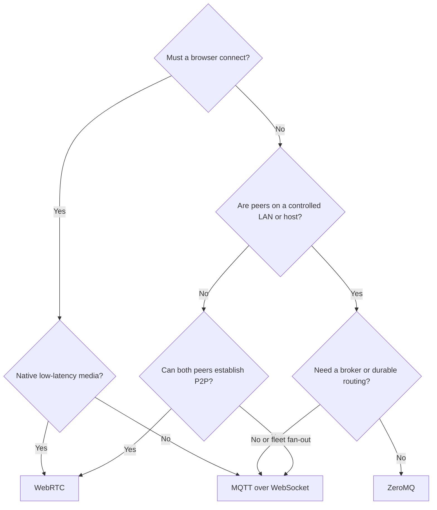

# Choose a transport

Transport choice is a deployment decision. MAGPIE keeps the application model stable, but latency, routing, reliability, network reachability, and infrastructure still differ.

| | ZeroMQ | MQTT | WebRTC |
|---|---|---|---|
| Topology | Direct sockets | Brokered | Peer-to-peer after signaling |
| Best fit | LAN, localhost, controlled networks | Fleet/cloud, NAT, fan-out | Low-latency internet data and media |
| Infrastructure | None | MQTT broker | Signaling; STUN/TURN as needed |
| Streaming | ✓ | ✓ | ✓ |
| RPC | ✓ | ✓ | ✓ |
| Native media tracks | — | — | Python and browser |
| Browser | — | MQTT over WebSocket | ✓ |
| Python | ✓ | ✓ | ✓ |
| C++ | ✓ | Optional | Optional |
| TypeScript | — | ✓ | Browser |

## A practical decision tree

## Recommended defaults

- Start with **ZeroMQ** for a local Python/C++ system with fixed endpoints.
- Start with **MQTT** for remote robots, fleets, browser dashboards, or services behind NAT.
- Add **WebRTC** when peer-to-peer latency, bandwidth, or native audio/video tracks matter.
- Use **MQTT or HTTP only for WebRTC signaling** when you do not want brokered data in the hot path.

## Switching transports

Switching normally changes connection construction and concrete class names. Topic names, payloads, handler logic, schemas, and application flow should remain stable. Treat a transport change as a deployment change and retest delivery semantics, timeouts, reconnection, and security.

