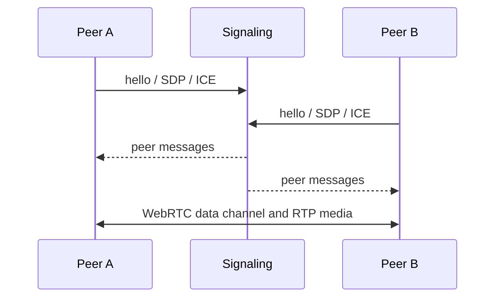

import Tabs from '@theme/Tabs';
import TabItem from '@theme/TabItem';

# WebRTC

WebRTC creates a peer-to-peer connection for MAGPIE streams, RPC, and media. MQTT, ZeroMQ, or HTTP is used only to exchange signaling messages; application data leaves the signaling path after negotiation.



## Choose signaling

| Signaling | Use it when |
|---|---|
| ZeroMQ | Both Python/C++ peers are on localhost or a controlled LAN |
| MQTT | Peers already reach a broker or sit behind NAT |
| HTTP | You have a web application backend or want a minimal opaque relay |

Signaling does not carry the steady-state media or RPC traffic.

## Connect peers

<Tabs groupId="language" queryString>
<TabItem value="python" label="Python" default>

```python
from luxai.magpie.transport.webrtc import WebRTCConnection, WebRTCOptions

options = WebRTCOptions(
    video_topics=["robot/camera/color"],
    audio_topics=["robot/microphone"],
    stun_servers=["stun:stun.l.google.com:19302"],
)

connection = WebRTCConnection.with_mqtt(
    "mqtts://broker.example.com:8883",
    session_id="robot-01",
    options=options,
    reconnect=True,
)
connection.connect(timeout=30)
```

</TabItem>
<TabItem value="cpp" label="C++">

```cpp
#include <magpie/transport/webrtc_connection.hpp>
#include <magpie/transport/webrtc_http_signaler.hpp>

auto signaler = std::make_shared<magpie::HttpSignaler>(
    "https://signal.example.com/webrtc", "robot-01");

magpie::WebRtcOptions options;
options.useMediaChannels = false;

auto connection = std::make_shared<magpie::WebRtcConnection>(
    signaler, options);
connection->connect();
```

</TabItem>
<TabItem value="typescript" label="TypeScript / browser">

```typescript
import {WebRtcConnection} from '@luxai-qtrobot/magpie'

const connection = await WebRtcConnection.withHttp(
  'https://signal.example.com/webrtc',
  'robot-01',
  {
    reconnect: true,
    webrtcOptions: {videoTopics: ['robot/camera/color']},
  },
)
await connection.connect(30)
```

MAGPIE.js WebRTC uses browser APIs and is not available in Node.js.

</TabItem>
</Tabs>

Create `WebRtcStreamWriter`/`WebRtcStreamReader` and `WebRTCRpcRequester`/`WebRTCRpcResponder` from the connected peer just as you create components from a shared MQTT connection.

## Data channels and media tracks

Ordinary values, frames, and RPC messages travel through the WebRTC data channel. Python and browser peers can route declared video or audio topics over native RTP tracks. Both peers must agree on topic names and compatible media configuration.

:::note C++ media interoperability
MAGPIE C++ currently sends image and audio frames over the data channel. When it communicates with a Python peer, set `use_media_channels=False` in Python and `useMediaChannels=false` in C++ so both sides use the same path.
:::

In a browser, local camera and microphone tracks can be attached directly:

```javascript
const media = await navigator.mediaDevices.getUserMedia({video: true, audio: true})
connection.sendVideoTrack(media.getVideoTracks()[0], 'robot/camera/color')
connection.sendAudioTrack(media.getAudioTracks()[0], 'robot/microphone')
```

## NAT traversal

STUN helps peers discover reachable addresses. TURN relays traffic when direct connectivity is impossible. Production internet deployments should provide controlled STUN/TURN configuration and test restrictive enterprise, mobile, and carrier-grade NAT networks.

```python
from luxai.magpie.transport.webrtc import WebRTCTurnServer

options = WebRTCOptions(
    stun_servers=["stun:stun.example.com:3478"],
    turn_servers=[
        WebRTCTurnServer(
            url="turn:turn.example.com:3478",
            username="robot-01",
            credential="short-lived-secret",
        )
    ],
)
```

## HTTP signaling relay

The included relay protocol treats signaling messages as opaque bytes and supports join, send, long-poll receive, and leave operations. The example in the Python repository is intentionally in-memory and single-process. A scaled service needs shared storage, authentication, authorization, TLS termination, rate limits, and participant expiry.

Read the [HTTP signaling contract](https://github.com/luxai-qtrobot/magpie/blob/main/docs/webrtc-http-signaling.md) or browse the [WebRTC examples](https://github.com/luxai-qtrobot/magpie/tree/main/examples/webrtc).

